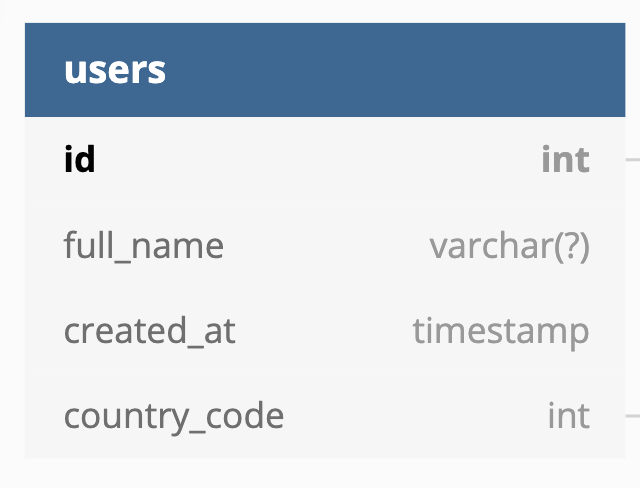

# Run FloorPlan

After checking out this repository, [make sure you have Gradle installed](https://gradle.org/install/) and run:
```
gradlew run --args="<path-to-schema-file>"
```

## Command-line arguments

### Output format

FloorPlan can render many different output formats, specified by the `--format` argument:

```
gradlew run --args="<path-to-schema-file> --format=<output-format>"
```

Currently, the supported formats are:

- DBML
- SVG
- PNG
- DOT

!!! info
    When not present, DBML is picked as default value as output format.

!!! warning
    Some arguments are restricted to their combination with the specified output format. Refer to the individual argument documentation to verify its availability.

### Write output to file

```
gradlew run --args="<path-to-schema-file> --output=<path-to-output-file>"
```

### Add `CREATION SQL` as [Table note](https://www.dbml.org/docs/#table-notes)

This option is **disabled by default** since it can be quite verbose and would 'duplicate' what a UI rendering tool (better) provides.
Opt-in by specifying:

```
gradlew run --args="<path-to-schema-file> --creation-sql-as-table-note"
```

!!! note "Availability: DBML"
    Only available when the [output format](#output-format) is DBML.

### Render [nullable fields in data types](https://github.com/julioz/FloorPlan/issues/12)



This option is **disabled by default**, opt-in with:

```
gradlew run --args="<path-to-schema-file> --render-nullable-fields"
```

!!! note "Availability: DBML"
    Only available when the [output format](#output-format) is DBML.
